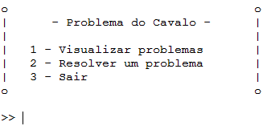

# Manual Técnico

### **Projeto N.º 1 - Época Normal**

Inteligência Artificial - Escola Superior de Tecnologia de Setúbal

2023/2024

Prof. Joaquim Filipe

**Grupo 17**

---

Nuno Martinho, n.º 201901769

João Coelho, n.º 201902001

João Barbosa, n.º 201901785

### **Índice**

- [**Introdução**](#introdução)
- [**Organização do projeto**](#organização-do-projeto)
- [**projeto.lisp**](#projetolisp)
- [**puzzle.lisp**](#puzzlelisp)
- [**procura.lisp**](#procuralisp)
- [**Resultados**](#resultados)
- [**Conclusões**](#conclusões)
- [**Limitações**](#limitações)


<a id="introdução"></a>
### **Introdução**

---

Neste manual técnico é abordada a implementação de um programa em ***LISP*** que tem como objetivo resolver tabuleiros do **Problema do Cavalo** (versão simplificada do Jogo do Cavalo), no qual o cavalo branco é deslocado ao longo do tabuleiro em jogadas sucessivas até não ser possível efetuar qualquer movimento ou até atingir o objetivo.

O objetivo deste será permitir que o utilizador possa receber uma **solução possível** para uma dada pontuação definida previamente para o problema, no **menor número de jogadas possível**.

<a id="organização-do-projeto"></a>

### **Organização do projeto**

---

O projeto foi implementado no ***LispWorks Personal Edition 8.0.1 (64bits)***, um ambiente de desenvolvimento integrado (IDE) para a linguagem de programação *Lisp*. Esta edição pessoal do *********LispWorks********* é uma versão gratuita e limitada do ambiente completo oferecido pela *LispWorks Ltd*.

Este encontra-se organizado em 3 ficheiros *.lisp*:

- ************************projeto.lisp************************ - corre o programa e carrega os outros componentes, lê e escreve ficheiros (funções *Read-Write*), e trata da interação com o utilizador.
- **********************puzzle.lisp********************** - implementação da resolução do problema.
- **procura.lisp** - implementação dos algoritmos de procura.

**Estruturas utilizadas**

Estas foram as estruturas utilizadas na implementação.

```lisp
;; <resultado>::= (<id-tabuleiro> <algoritmo> <objetivo> <hora-inicio> <solucao> <hora-fim> <heuristica/profundidade>)
;; <no>::= (<tabuleiro> <pai> <pontos-objetivo> <pontos-atual> <profundidade> <>)
;; <solucao>::= (<caminho-solucao> <n-abertos> <n-fechados>)
```

<a id="projetolisp"></a>

### **projeto.lisp**

---

Neste ficheiro encontram-se funções relativas ao carregamento, leitura e escrita de ficheiros, bem como à interação com o utilizador.

O programa é iniciado ao executar a função ***jogar*** que apresenta um menu principal com 3 opções:

1. mostrar um tabuleiro entre todos os disponíveis no ficheiro ******************************************problemas.dat******************************************;
2. resolver um tabuleiro;
3. sair do programa.

```lisp
(defun iniciar ()
"Inicializa o programa."
    (menu)
    (susbtituir-f-no-ficheiro)
    (let ((opcao (read)))
        (case opcao
            (1 
                (progn 
                    (print-tabuleiros)
                    (iniciar)
            ))
            (2
                (progn
                    (opcao-algoritmo)
                    (iniciar)
            ))
            (3 
                (progn (format t "Obrigado por jogar!~%~%") (quit)
            ))

            (otherwise (progn (format t "Escolha uma opção válida!") (iniciar)))    
        )
    )
)
```



Menu principal

Para que seja possível apresentar os tabuleiros contidos no ficheiro *problemas.dat* é usada uma função ***ler-tabuleiros*** para ler esse mesmo ficheiro.

```lisp
;; (ler-tabuleiros)
(defun ler-tabuleiros ()
"Le os tabuleiros no ficheiro problemas.dat."
    (with-open-file (stream (concatenate 'string (diretorio) "problemas.dat") :if-does-not-exist nil)
        (do ((result nil (cons next result))
                (next (read stream nil 'eof) (read stream nil 'eof)))
                    ((equal next 'eof) (reverse result)))))
```

Ao selecionar a primeira opção **Visualizar problemas** o utilizador verá então no ecrã uma lista com todos os tabuleiros lidos a partir da função anterior. 

O tabuleiro F presente no ficheiro ***************************************problemas.dat*************************************** é gerado aleatoriamente cada vez que o programa é iniciado através da seguintes função:

```lisp
(defun substituir-tabuleiro-f (dados novo-tabuleiro)
"Substitui o tabuleiro do problema F."
  (let ((dados-atualizados (mapcar (lambda (item)
                                (if (and (listp item) (string= "f" (car item)))
                                    (list (car item) (cadr item) novo-tabuleiro)
                                    item)
                                ) dados)
        )) dados-atualizados
    )
)

(defun substituir-f-no-ficheiro ()
"Susbstitui o tabuleiro do problema F no ficheiro."
    (let* ((dados-ficheiro (ler-tabuleiros))
            (novo-tabuleiro (tabuleiro-aleatorio))
        )
        (when dados-ficheiro
            (let ((dados-atualizados (substituir-tabuleiro-f dados-ficheiro novo-tabuleiro)))
                (if dados-atualizados
                    (escrever-no-ficheiro dados-atualizados)
                    (format t "Tabuleiro F nao gerado!"))))))
```

Voltando ao menu principal, temos a segunda opção do menu **Resolver um problema** que permite ao utilizador escolher um algoritmo, um tabuleiro e, se aplicável, profundidade máxima ou heurística. No fim, é calculada a solução e apresentada no ecrã do utilizador, voltando de seguida ao menu inicial.

```lisp
(defun opcao-algoritmo ()
"Recebe a opcao de algoritmo do utilizador e executa-o."
    (progn
        (algoritmos-menu)
        (let ((opcao (read)))
            (cond ((equal opcao '0) (iniciar))
                    ((or (< opcao 0) (> opcao 4)) (progn (format t "Escolha uma opcao valida!~%") (opcao-algoritmo)))
                    ((not (numberp opcao)) (progn (format t "Escolha uma opcao valida!~%")))
                    (T (let* (
                                (id-tabuleiro (opcao-tabuleiro))
                                (problema (escolher-problema id-tabuleiro))
                                (nome (nome-problema problema))
                                (tabuleiro (tabuleiro-problema problema))
                                (objetivo (pontuacao-problema problema))
                            )
                        (ecase opcao
                            (1
                                (let* (                                   
                                    (resultado (list nome 'BFS objetivo (get-internal-real-time) (bfs-recursivo tabuleiro objetivo 'usar-operadores 'calcular-pontos 'posicao-cavalo 'tabuleiros-cavalo-inicial) (get-internal-real-time)))
                                    )
                                    (progn
                                        (format-solucao resultado)
                                        (if (fifth resultado)
                                            (ficheiro-estatisticas resultado)
                                        )
                                    )
                                )
                            )
                            (2
                                (let* (
                                        (profundidade-max (opcao-profundidade))
                                        (resultado (list nome 'DFS objetivo (get-internal-real-time) (dfs-recursivo tabuleiro objetivo 'usar-operadores 'calcular-pontos 'posicao-cavalo 'tabuleiros-cavalo-inicial profundidade-max) (get-internal-real-time) profundidade-max))
                                    )
                                    (progn
                                        (format-solucao resultado)
                                        (if (fifth resultado)
                                            (ficheiro-estatisticas resultado)
                                        )
                                    )
                                )
                            )
                            (3
                                (let* (
                                        (heuristica (opcao-heuristica))
                                        (resultado (list nome 'A* objetivo (get-internal-real-time) (a* tabuleiro objetivo 'usar-operadores 'calcular-pontos 'posicao-cavalo 'tabuleiros-cavalo-inicial heuristica) (get-internal-real-time) heuristica))
                                    )
                                    (progn
                                        (format-solucao resultado)
                                        (if (fifth resultado)
                                            (ficheiro-estatisticas resultado) )))))))))))
```


Menu algoritmo


Menu profundidade máxima


Menu tabuleiro


Menu heurística

Também é criado ou ficheiro ***resultados.dat*** com resultados mais detalhados de todas as soluções encontradas.

```lisp
(defun ficheiro-estatisticas (resultado)
"Ficheiro de resultados estatisticos (solucao + dados estatisticos sobre a eficiencia)."
    (with-open-file (stream (concatenate 'string (diretorio) "resultados.dat") :direction :output :if-does-not-exist :create :if-exists :append)
        (estatisticas stream resultado)
        (finish-output stream)
        (close stream)
))
```

<a id="puzzle.lisp"></a>

### **puzzle.lisp**

---

A função usar operadores, executa cada operador para o tabuleiro e guarda a lista com os tabuleiros com a jogada realizada,  e caso o movimento não for possível para uma operação ela retornará NIL, que depois é removido da lista.

```lisp
(defun usar-operadores (tabuleiro)
  "Lista de tabuleiros com cada jogada possivel."
  (remover-se #'(lambda (x) (eq x nil))
              (list
               (operador-1 tabuleiro)
               (operador-2 tabuleiro)
               (operador-3 tabuleiro)
               (operador-4 tabuleiro)
               (operador-5 tabuleiro)
               (operador-6 tabuleiro)
               (operador-7 tabuleiro)
               (operador-8 tabuleiro))))
```

Função que gera um tabuleiro com valores aleatórios (tabuleiro n x n) com valor default 10x10.

```lisp
;; (tabuleiro-aleatorio)
(defun tabuleiro-aleatorio (&optional (lista (baralhar (lista-numeros))) (n 10))
  "Funcao que gera um tabuleiro n x n (10 x 10 valor default)"
  (cond
   ((null lista) nil)
   (t (cons (subseq lista 0 n) (tabuleiro-aleatorio (subseq lista n) n)))))
```

- ***posicionar-cavalo***: permite posicionar o cavalo numa posição do tabuleiro.
- ***tabuleiros-cavalo-inicial***: Se o tabuleiro que estamos a analisar não conter o cavalo, então ele precisará de ser colocado numa das posições válidas da primeira linha. Esta função irá retornar uma lista de tabuleiros com o cavalo em cada posição válida da primeira linha.

```lisp
(defun posicionar-cavalo (tabuleiro &optional (lin 0) (col 0))
  "Posiciona o cavalo no tabuleiro na dada linha, coluna."
  (substituir lin col tabuleiro T))

(defun tabuleiros-cavalo-inicial (tabuleiro-sem-cavalo)
  "Devolve uma lista com os tabuleiros em que o cavalo está posicionado numa casa valida da primeira linha."
  (mapcar #'(lambda (pos)
              (posicionar-cavalo tabuleiro-sem-cavalo (car pos) (cadr pos)))
    (casas-validas-posicoes tabuleiro-sem-cavalo)))
```

Função que trata de mover o cavalo para a posição indicada (linha e coluna) e depois aplica as regras do jogo, removendo o simétrico ou o número duplo referente ao valor da casa em que o cavalo se deslocou, retorna o tabuleiro com as devidas alterações.

```lisp
(defun mover-cavalo (tabuleiro &optional (valLinha 0) (valColuna 0))
  "Funcao auxiliar para os operadores."
  (let* ((tabuleiroComCavalo tabuleiro)
         (lin (car (posicao-cavalo tabuleiroComCavalo)))
         (col (cadr (posicao-cavalo tabuleiroComCavalo)))
         (novaPosicaoCavalo (celula (+ lin valLinha) (+ col valColuna) tabuleiroComCavalo)))

    (cond
     ((eq novaPosicaoCavalo NIL) NIL) ;;posicao invalida, movimento ilegal.

     (t
       (let* ((tabuleiroJogada (substituir (+ lin valLinha) (+ col valColuna) (substituir lin col tabuleiroComCavalo) T))
              (duplos-list (posicao-duplos tabuleiroJogada))
              (duplo (if duplos-list
                         (nth (random (length duplos-list)) duplos-list)
                         nil)))
         (if (eq t (duplop novaPosicaoCavalo))
             (substituir (car duplo) (cadr duplo) tabuleiroJogada)
             (eliminar-simetrico novaPosicaoCavalo tabuleiroJogada)))))))
```

<a id="procura.lisp"></a>

### **procura.lisp**

---

Aqui estão as funções principais dos algoritmos desenvolvidos de forma recursiva.

- ***BFS-RECURSIVO:*** Função que trata do processo do algotimo bfs, transforma o tabuleiro recebido num nó e gera os primeiros sucessores, caso o tabuleiro não tenha o cavalo posicionado. Coloca esse nó numa lista de abertos e depois chama a função recursiva ***bfs-aux*** que trata de todo o processo do algoritmo ***BFS***.
- ***DFS-RECURSIVO:*** Função que trata do processo do algoritmo dfs, essencialmente faz a mesma coisa que a função anterior, com diferença que chama a função recursiva ***dfs-aux*** que trata de todo o processo do algoritmo.
- ***A\*:*** Função primária do algoritmo, funciona de forma similar aos anteriores, mas chama a função a\*-aux 

> O código abaixo está devidamente comentado a cada linha importante, mais especificamente nos algoritmos auxiliares.

```lisp
;; ============= ALGORITMOS =============

;;(bfs-recursivo (tabuleiro-jogado) 100 'usar-operadores 'calcular-pontos 'posicionar-cavalo)
;;(bfs-recursivo (tabuleiro-teste) 100 'usar-operadores 'calcular-pontos 'posicionar-cavalo)
(defun bfs-recursivo (tabuleiro pontos-objetivo expandir-nos fn-calcular-pontos fn-pos-cavalo tabuleiros-cavalo-inicial)
  "Algoritmo BFS recursivo para resolver o problema do cavalo."

  (let* ((no-inicial (criar-no-inicial tabuleiro pontos-objetivo))
         (primeiros-sucressores
          (if (funcall fn-pos-cavalo tabuleiro) (list no-inicial) (gerar-sucessores no-inicial tabuleiros-cavalo-inicial fn-calcular-pontos)))
         (abertos primeiros-sucressores))
    (bfs-recursivo-aux abertos '() (lambda (no) (gerar-sucessores no expandir-nos fn-calcular-pontos)))))

(defun bfs-recursivo-aux (abertos fechados expandir-nos)
  "Auxiliar da função bfs"
  (cond
   ((null abertos) '())
   (t
     (let* ((no-atual (car abertos)) ;; remove o no-atual de abertos
                                    (novos-fechados (append fechados (list no-atual))) ;; coloca o no em fechados
                                    (sucessores (funcall expandir-nos no-atual)) ;; expande o no
                                    (novos-abertos (append (cdr abertos) sucessores))) ;; mete os novos sucessores em abertos
       (if (verificar-solucao no-atual) ;; verifica se é solução
           (list (caminho-solucao no-atual) (length abertos) (length fechados)) ;; se sim devolve o caminho solução com nAbertos e n fechados
           (bfs-recursivo-aux novos-abertos novos-fechados expandir-nos)))))) ;; Se não, continua a procurar


;; DFS RECURSIVO
(defun dfs-recursivo (tabuleiro pontos-objetivo expandir-nos fn-calcular-pontos fn-pos-cavalo tabuleiros-cavalo-inicial &optional (d 20))
  "Algoritmo DFS recursivo para resolver o problema do cavalo."

  (let* ((no-inicial (criar-no-inicial tabuleiro pontos-objetivo))
         (primeiros-sucressores
          (if (funcall fn-pos-cavalo tabuleiro) (list no-inicial) (gerar-sucessores no-inicial tabuleiros-cavalo-inicial fn-calcular-pontos)))
         (abertos primeiros-sucressores))
    (dfs-recursivo-aux abertos '() (lambda (no) (gerar-sucessores no expandir-nos fn-calcular-pontos)) d)))

(defun dfs-recursivo-aux (abertos fechados expandir-nos d)
  (cond
   ((null abertos) '())
   (t
     (let* ((no-atual (car abertos)) ;; remove o no-atual de abertos
                                    (novos-fechados (append fechados (list no-atual))) ;; coloca o no em fechados

                                    )
       (if (> (no-profundidade no-atual) d) ;; verificar se a profundidade de um no maior que o limite d
           (dfs-recursivo-aux (cdr abertos) novos-fechados expandir-nos d) ;; Se sim, passa para outro no
           (let* ((sucessores (funcall expandir-nos no-atual)) ;; expande o no
                  (novos-abertos (append sucessores (cdr abertos)))) ;; coloca os sucessores no inicio de abertos.
             (cond
              ((verificar-solucao no-atual) (list (caminho-solucao no-atual) (length abertos) (length fechados))) ;;devolve o caminho solucao com n Abertos e n fechados

              (t (dfs-recursivo-aux novos-abertos novos-fechados expandir-nos d))))))))) ;; caso contrario continua a explorar em profundidade


(defun a* (tabuleiro pontos-objetivo expandir-nos fn-calcular-pontos fn-pos-cavalo tabuleiros-cavalo-inicial fn-heuristica)
  "Algoritmo A* recursivo para resolver o problema do cavalo."
  (let* ((no-inicial (criar-no-inicial-a* tabuleiro pontos-objetivo 0 0 0 0))
         (primeiros-sucessores
          (if (funcall fn-pos-cavalo tabuleiro) (list no-inicial) (gerar-sucessores-a* no-inicial tabuleiros-cavalo-inicial fn-calcular-pontos fn-heuristica)))
         (abertos primeiros-sucessores))
    (a*-aux abertos '() (lambda (no) (gerar-sucessores-a* no expandir-nos fn-calcular-pontos fn-heuristica)) fn-calcular-pontos fn-heuristica)))


    (defun a*-aux (abertos fechados expandir-nos fn-calcular-pontos fn-heuristica)
  "Funcao auxiliar a*, que processa os nos"
  (if (null abertos)
      '()
      (let* ((no-atual (car (ordenar-por-f abertos)));; remove o no-atual com menor f de abertos
                                                     (novos-fechados (ordenar-por-f (append fechados (list no-atual)))) ;; mete em fechados por ordem de f
                                                     (sucessores (funcall expandir-nos no-atual)) ;; expande o no
                                                     (fechados-para-abrir (recalcular-fechados fechados sucessores no-atual)) ;;ve se algum sucessor existe em fechados, se sim fica o que tem menor valor de f para passar para abertos
                                                     (novos-abertos (recalcular-abertos (cdr abertos) sucessores no-atual)) ;;verifica entre os abertos e sucessores se existe algum estado igual, se sim fica o com menor valor de f
                                                     (abertos-com-novos-fechados (append novos-abertos (remover-duplicados sucessores novos-abertos) fechados-para-abrir)) ;;junta em abertos, os sucessores que nao estao em abertos nem fechados, e os novos fechados para abertos
             )

        (if (verificar-solucao no-atual) ;; verifica se � no solucao
            (list (caminho-solucao no-atual) (length abertos) (length fechados)) ;; da a solucao
            (a*-aux (remover-duplicados (reverse (ordenar-por-f abertos-com-novos-fechados)) (ordenar-por-f fechados-para-abrir)) 
                    (remover-duplicados novos-fechados fechados-para-abrir) expandir-nos fn-calcular-pontos fn-heuristica) ;; continua
            ))))
```

Aqui estão as funções referentes ao desempenho dos algoritmos:

- ***fator-ramificacao-media***: que calcula o fator de ramificação média pelo método da bissecção.
- Depois também temos a função ***penetrancia*** que calcula a penetrância de um algoritmo.

```lisp
;; ============ MEDIDAS DE DESEMPENHO ============

;; fator de ramificacao media
(defun fator-ramificacao-media (lista &optional (L (tamanho-solucao lista)) (valor-T (num-nos-gerados lista)) (B-min 0) (B-max valor-T) (margem 0.1))
  "Retorna o fator de ramificacao media (metodo bisseccao)"
  (float (let ((B-avg (/ (+ B-min B-max) 2)))
           (cond ((< (- B-max B-min) margem) (/ (+ B-max B-min) 2))
                 ((< (aux-ramificacao B-avg L valor-T) 0) (fator-ramificacao-media lista L valor-T B-avg B-max margem))
                 (T (fator-ramificacao-media lista L valor-T B-min B-avg margem))))))

;; B + B^2 + ... + B^L = T
(defun aux-ramificacao (B L valor-T)
  (cond
   ((= 1 L) (- B valor-T))
   (T (+ (expt B L) (aux-ramificacao B (- L 1) valor-T)))))

(defun penetrancia (solucao)
  "Calcula a penetrancia"
  (float (/ (tamanho-solucao solucao) (num-nos-gerados solucao))))
```

<a id="resultados"></a>

### **Resultados**

---

As tabelas a seguir apresentadas apresentam resultados calculados para cada tabuleiro com os algoritmos implementados.

| Tabuleiro | Objetivo (Pontos) | Algoritmo | Heurística | Profundidade máxima | Pontos | Profundidade | Nós gerados | Nós expandidos | Penetrância | F.R.M. | Duração (s) |
| --- | --- | --- | --- | --- | --- | --- | --- | --- | --- | --- | --- |
| A | 70 | BFS | - | - | 72 | 3 | 9 | 7 | 0.4444 | 1.3711 | 0.034 |
| A | 70 | DFS | - | 20 | 72 | 3 | 7 | 5 | 0.5714 | 1.2305 | 0.023 |
| A | 70 | A* | Base | - | 72 | 3 | 7 | 4 | 0.5714 | 1.2305 | 0.027 |

| Tabuleiro | Objetivo (Pontos) | Algoritmo | Heurística | Profundidade máxima | Pontos | Profundidade | Nós gerados | Nós expandidos | Penetrância | F.R.M. | Duração (s) |
| --- | --- | --- | --- | --- | --- | --- | --- | --- | --- | --- | --- |
| B | 60 | BFS | - | - | 64 | 10 | 50 | 49 | 0.2200 | 1.2207 | 0.260 |
| B | 60 | DFS | - | 20 | 64 | 10 | 14 | 9 | 0.7857 | 1.066 | 0.054 |
| B | 60 | A* | Base | - | 64 | 10 | 50 | 49 | 0.2200 | 1.2207 | 0.300 |

| Tabuleiro | Objetivo (Pontos) | Algoritmo | Heurística | Profundidade máxima | Pontos | Profundidade | Nós gerados | Nós expandidos | Penetrância | F.R.M. | Duração (s) |
| --- | --- | --- | --- | --- | --- | --- | --- | --- | --- | --- | --- |
| C | 270 | BFS | - | - | 272 | 6 | 42 | 36 | 0.1666 | 1.4355 | 0.183 |
| C | 270 | DFS | - | 20 | 272 | 6 | 16 | 7 | 0.4375 | 1.2188 | 0.053 |
| C | 270 | A* | Base | - | 282 | 6 | 39 | 31 | 0.1795 | 1.4092 | 0.189 |

| Tabuleiro | Objetivo (Pontos) | Algoritmo | Heurística | Profundidade máxima | Pontos | Profundidade | Nós gerados | Nós expandidos | Penetrância | F.R.M. | Duração (s) |
| --- | --- | --- | --- | --- | --- | --- | --- | --- | --- | --- | --- |
| D | 600 | BFS | - | - | 665 | 12 | 274 | 268 | 0.0474 | 1.3713 | 1.235 |
| D | 600 | DFS | - | 20 | 665 | 12 | 40 | 29 | 0.3500 | 1.1328 | 0.141 |
| D | 600 | A* | Base | - | 665 | 12 | 52 | 33 | 0.2500 | 1.1934 | 0.187 |

O tabuleiro E é impossível de resolver devido às regras fundamentais do jogo implementado.

| Tabuleiro | Objetivo (Pontos) | Algoritmo | Heurística | Profundidade máxima | Pontos | Profundidade | Nós gerados | Nós expandidos | Penetrância | F.R.M. | Duração (s) |
| --- | --- | --- | --- | --- | --- | --- | --- | --- | --- | --- | --- |
| E | 300 | BFS | - | o.m.b. | o.m.b. | o.m.b. | o.m.b. | o.m.b. | o.m.b. | o.m.b. | o.m.b. |
| E | 300 | DFS | - | o.m.b. | o.m.b. | o.m.b. | o.m.b. | o.m.b. | o.m.b. | o.m.b. | o.m.b. |
| E | 300 | A* | Base | o.m.b. | o.m.b. | o.m.b. | o.m.b. | o.m.b. | o.m.b. | o.m.b. | o.m.b. |

```lisp
Tabuleiro F (aleatório)
(
	(35 91 98 37 44 8 61 75 21 43) 
	(41 25 9 12 13 26 80 99 84 56) 
	(63 16 82 93 20 94 45 32 29 65)
	(73 27 69 47 36 87 83 7 92 74) 
	(52 57 24 81 33 60 18 0 76 58) 
	(42 66 17 38 39 46 31 89 78 40) 
	(97 59 62 34 15 77 30 50 2 67) 
	(3 1 53 14 48 79 95 64 4 11) 
	(90 28 23 71 70 10 51 86 72 22) 
	(88 19 5 6 49 55 54 68 85 96)
)
```

| Tabuleiro | Objetivo (Pontos) | Algoritmo | Heurística | Profundidade máxima | Pontos | Profundidade | Nós gerados | Nós expandidos | Penetrância | F.R.M. | Duração (s) |
| --- | --- | --- | --- | --- | --- | --- | --- | --- | --- | --- | --- |
| F | 2000 | BFS | - | s.a.o. | s.a.o. | s.a.o. | s.a.o. | s.a.o. | s.a.o. | s.a.o. | s.a.o. |
| F | 2000 | DFS | - | 50 | 2012 | 46 | 140 | 48 | 0.3357 | 1.0596 | 0.706 |
| F | 2000 | A* | Base | - | 2011 | 27 | 133 | 28 | 0.2105 | 1.0715 | 0.692 |

> F.R.M. → Fator de Ramificação Média
( - ) → não aplicável
> 
> 
> *s.a.o.* → *stack allocation overflow*
> 

<a id="conclusões"></a>

### **Conclusões**

---

Analisando a tabela com os resultados gerados pelos algoritmos, podemos observar que os algoritmos DFS e A* são os mais eficientes em relação ao algoritmo BFS que tem uma performance menor, e quando apresentado com um problema com uma escala maior, muitas das vezes não o consegue o resolver (como mostrado no problema F).

Podemos reparar também que para este tipo de jogo o DFS aparenta encontrar uma solução mais rápida e com uma penetrância mais perto de 1, que o A*, essa solução não sendo necessariamente a melhor solução. Isto deve-se à natureza do jogo, os algoritmos e da heuristica usada O algoritmo A* tenta encontrar o caminho com menor valor para a função de avaliação (gerando e expandindo nós), o DFS só procura num certo caminho até à profundidade limite definida pelo utilizador, podendo encontrar uma solução mais rápida e sem gerar/expandir mais nós.

<a id="limitações"></a>

### **Limitações**

---

A principal limitação do programa corresponde à limitação de memória da edição do *software* ************LispWorks Personal Edition************.

Todos os requisitos base enumerados no enunciado foram implementados à exceção de:

- Heurística personalizada
- Bónus
    1. Implementação da estratégia SMA*;
    2. Implementação da estratégia IDA*;
    3. Implementação da estratégia RBFS