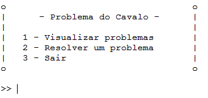

# Manual de Utilizador

### **Projeto N.º 1 - Época Normal**

Inteligência Artificial - Escola Superior de Tecnologia de Setúbal

2023/2024

Prof. Joaquim Filipe

**Grupo 17**

---

Nuno Martinho, n.º 201901769

João Coelho, n.º 201902001

João Barbosa, n.º 201901785

### **Índice**

- [**Acrónimos e Siglas**](#acrónimos-e-siglas)
- [**Introdução**](#introdução)
- [**Instalação e Utilização**](#instalação-e-utilização)

---
<a id="acrónimos-e-siglas"></a>
### **Acrónimos e Siglas**

---

> IDE - Integrated Development Environment (Ambiente de Desenvolvimento Integrado)
> 

> Listener - Ferramenta do *LispWorks* em que executamos funções.
> 

> Stack - A memória stack é uma região de armazenamento temporário na RAM.
>
<a id="introdução"></a>
### **Introdução**

---

Este manual tem como objetivo ser um guia para a correta utilização do programa Problema do Cavalo, uma versão simplificada do jogo original, onde nesta versão só existe um jogador (o computador) que vai tentar resolver os vários problemas localizados no ficheiro *problemas.dat*, através do algoritmo escolhido para esse tabuleiro.
Este programa foi desenvolvido na linguagem de programação LISP.

<a id="instalação-e-utilização"></a>
### **Instalação e Utilização**

---

> Instalação
> 

Para que o programa possa funcionar é necessário possuir um *IDE* ou um interpretador que compile a linguagem *Common LISP* (É recomendado o programa *LispWorks Personal Edition 8.0.1(64-bit)*).

1. Abrir com o programa escolhido o ficheiro projeto.lisp
2. (Opcional) Se estiver a usar o *LispWorks* é recomendado aumentar o *stack* do *listener*: Tools → *Preferences*… → *Listener* → *Initial stack size* → Alterar de *Default* para 64000.
3. Reabrir/Abrir o *Listener*
4. Compilar o ficheiro projeto.lisp
5. No *listener* escrever (jogar).

Se os passos anteriores forem seguidos deverá aparecer o menu inicial do programa:



> Utilização
> 

Para iniciar o programa é necessário executar a função (Jogar).


Para continuar a navegar pelos menus basta apenas premir um dos algarismos presentes no ecrã e clicar na tecla ***Enter.***

Poderá utilizar a opção **1 - Visualizar problemas** para visualizar todos os tabuleiros/problemas disponíveis.

> Resolução de um problema
> 

Se selecionou a opção **2 - Resolver um problema** irá encontrar o seguinte ecrã:


Escolha um algoritmo de procura dentro dos apresentados introduzindo o número correspondente.

Após a escolha do algoritmo poderá selecionar um dos tabuleiros presentes no ficheiro problemas.dat:


```lisp
Atenção: em alguns algoritmos poderá ser-lhe pedido para introduzir um valor de
*profundidade máxima* ou para selecionar uma heurística. Nesse caso, basta que
interaja como nos menus anteriores e siga as instruções.
```

Ao selecionar um dos tabuleiros será calculada e apresentada a solução respetiva tanto no ecrã como num ficheiro externo resultados.dat criado automaticamente pelo programa.


